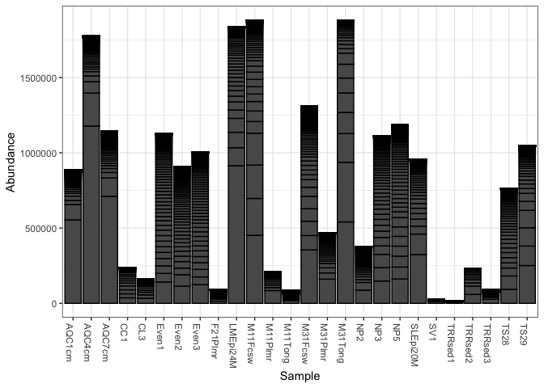
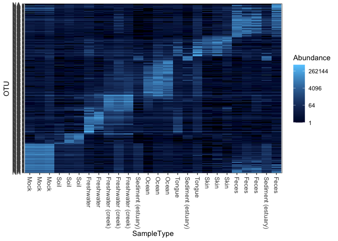

R Markdown
----------

This is an R Markdown document. Markdown is a simple formatting syntax
for authoring HTML, PDF, and MS Word documents. For more details on
using R Markdown see
<a href="http://rmarkdown.rstudio.com" class="uri">http://rmarkdown.rstudio.com</a>.

When you click the **Knit** button a document will be generated that
includes both content as well as the output of any embedded R code
chunks within the document. You can embed an R code chunk like this:

``` r
library("phyloseq"); packageVersion("phyloseq")
```

    ## Warning: replacing previous import 'vctrs::data_frame' by 'tibble::data_frame'
    ## when loading 'dplyr'

    ## [1] '1.32.0'

``` r
data("GlobalPatterns")
library("ggplot2"); packageVersion("ggplot2")
```

    ## [1] '3.3.2'

``` r
theme_set(theme_bw())
pal = "Set1"
scale_colour_discrete <-  function(palname=pal, ...){
  scale_colour_brewer(palette=palname, ...)
}
scale_fill_discrete <-  function(palname=pal, ...){
  scale_fill_brewer(palette=palname, ...)
}

GP <- prune_species(speciesSums(GlobalPatterns) > 0, GlobalPatterns)
```

    ## Warning: 'prune_species' is deprecated.
    ## Use 'prune_taxa' instead.
    ## See help("Deprecated") and help("phyloseq-deprecated").

    ## Warning: 'speciesSums' is deprecated.
    ## Use 'taxa_sums' instead.
    ## See help("Deprecated") and help("phyloseq-deprecated").

``` r
plot_richness(GP)
```



``` r
data("GlobalPatterns")
gpt <- subset_taxa(GlobalPatterns, Kingdom=="Bacteria")
gpt <- prune_taxa(names(sort(taxa_sums(gpt),TRUE)[1:300]), gpt)
plot_heatmap(gpt, sample.label="SampleType")
```

    ## Warning: Transformation introduced infinite values in discrete y-axis


